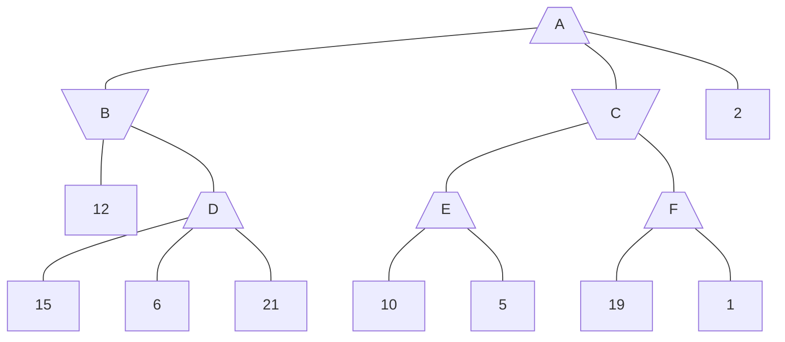
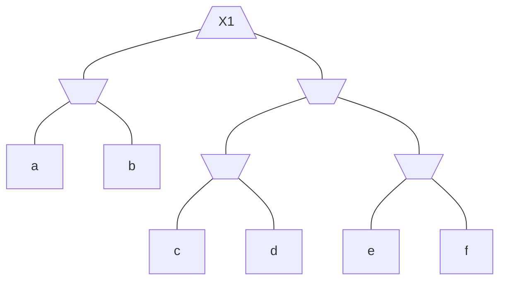
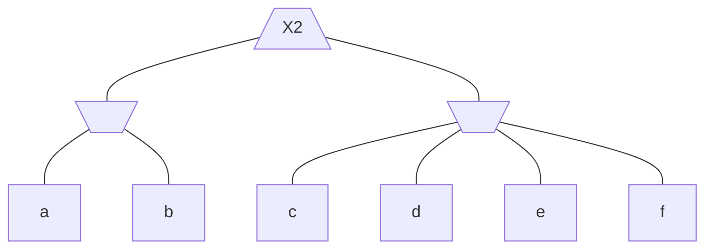
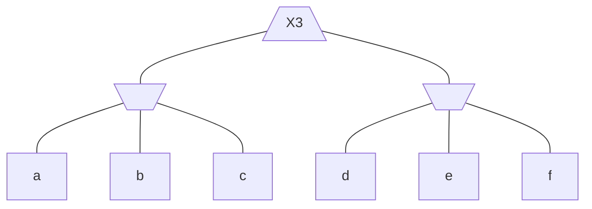
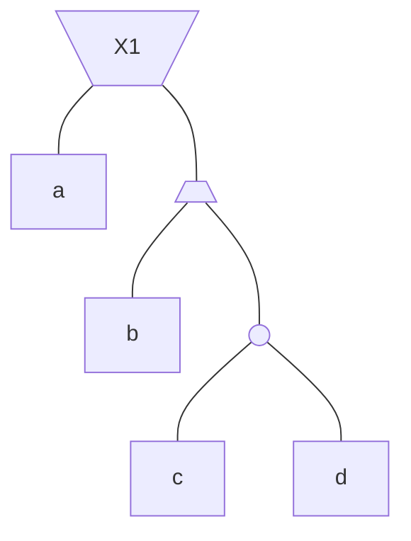
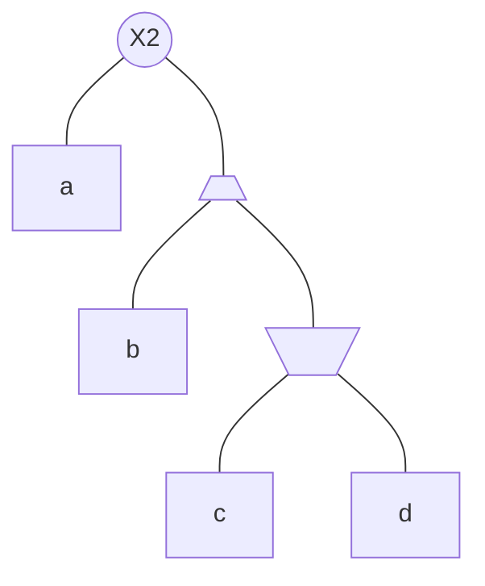
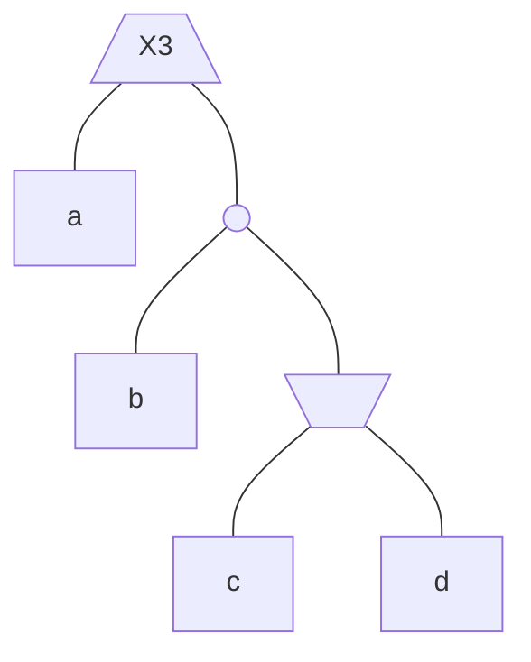

# Practice 3[^1]

For questions with circular bubbles ($\bigcirc$), you may select only one choice.

For questions with square checkboxes ($\square$), you may select one or more choices.

**Please show all work for credit.**

# CSPs with Preferences (4 points)

Let us formulate a CSP with variables 𝐴, 𝐵, 𝐶, 𝐷, and domains of {1, 2, 3} for each of these variables. A **valid assignment** in this CSP is defined as a complete assignment of values to variables which satisfies the following constraints:

- B will not ride in car 2.
- A and B refuse to ride in the same car.
- The sum of the car numbers for B and C is less than 4. 
- A’s car number must be greater than C’s car number. 
- B and D refuse to ride in the same car.
- C’s car number must be lesser than D’s car number.

## Question 1

Draw the corresponding constraint graph for this CSP.

Although there are several valid assignments which exist for this problem, A, B, C and D have additional “soft" preferences on which value they prefer to be assigned. To encode these preferences, we define utility functions $U_{\text{Var}}(\text{Val})$ which represent the preference of an assignment of the value(Val) to the variable(Var).

For a complete assignment $P = \{ A:V_A, B:V_B, \cdots , D:V_D \}$, the utility of $P$ is defined as the sum of the utility values: $U_A(V_A)+U_B(V_B)+U_C(V_C)+U_D(V_D)+$. A higher utility for P indicates a higher preference for that complete assignment. This scheme can be extended to an arbitrary CSP, with several variables and values.

We can now define a modified CSP problem, whose goal is to find the valid assignment which has the maximum utility amongst all valid assignments.

\
\
\
\
\
\
\
\
\
\
\
\
\
## Question 2

Suppose the utilities for the assignment of values to variables is given by the table below

| U    | $U_A$ | $U_B$ | $U_C$ | $U_D$ |
| ---- | ----- | ----- | ----- | ----- |
| 1    | 7     | 10    | 200   | 2000  |
| 2    | 6     | 20    | 300   | 1000  |
| 3    | 5     | 30    | 100   | 3000  |

Under these preferences, given a choice between the following complete assignments which are valid solutions to the CSP, which would be the preferred solution.

$\bigcirc$ A:3 B:1 C:1 D:2

$\bigcirc$ A:3 B:1 C:2 D:3

$\bigcirc$ A:3 B:1 C:1 D:3

$\bigcirc$ A:2 B:1 C:1 D:2

To decouple from the previous questions, for the rest of the question, the preference utilities are not necessarily the table shown above but can be arbitrary positive values.

This problem can be formulated as a modified search problem, where we use the modified tree search shown below to find the valid assignment with the highest utility, instead of just finding an arbitrary valid assignment.

The search formulation is:
- State space: The space of partial assignments of values to variables
- Start state: The empty assignment
- Goal Test: State $X$ is a valid assignment
- Successor function: The successors of a node $X$ are states which have partial assignments which are the assignment in $X$ extended by one more assignment of a value to an unassigned variable, as long as this assignment does not violate any constraints
- Edge weights: Utilities of the assignment made through that edge

In the algorithm below $f(\text{node})$ is an **estimator of distance** from *node* to goal, $\text{ACCUMULATED-UTILITY-FROM-START}(\text{node}) is the sum of utilities of assignments made from the *start-node* to the current *node*.

```js
function MODIFIEDTREESEARCH(problem, start-node) 
  fringe ← INSERT(key ∶ start-node, value ∶ 𝑓 (start-node)) 
  do
    if ISEMPTY(fringe) then 
      return failure
    end if
    node, cost ← remove entry with maximum value from fringe 
    if GOAL-TEST(node) then
      return node 
    end if
    for child in SUCCESSORS(node) do
      fringe ← INSERT(key ∶ child, value ∶ 𝑓 (child) + ACCUMULATED-UTILITY-FROM-START(child))
    end for 
  while True
end function
```

## Question 3

Under this search formulation, for a node $X$ with assigned variables $\{ v_1,v_2, \cdots v_n \}$ and unassigned variables {𝑢1,𝑢2,𝑢3...𝑢𝑚}

1. Which of these expressions for $f(X)$ in the algorithm above, is guaranteed to give an optimal assignment according to the preference utilities. (Select **all** that apply)

$$
\square
f_1 = \min_{ Val_{1}, Val_{2}, \cdots , Val_{m} } 
U_{u_1}(\text{Val}_1) + 
U_{u_2}(\text{Val}_2) + 
\cdots +
U_{u_m}(\text{Val}_m)
$$

$$
\square
f_2 = \max_{ Val_{1}, Val_{2}, \cdots , Val_{m} } 
U_{u_1}(\text{Val}_1) + 
U_{u_2}(\text{Val}_2) + 
\cdots +
U_{u_m}(\text{Val}_m)
$$

$$
\square
f_3 = \min_{ Val_{1}, Val_{2}, \cdots , Val_{m} } 
U_{u_1}(\text{Val}_1) + 
U_{u_2}(\text{Val}_2) + 
\cdots +
U_{u_m}(\text{Val}_m)
\text{such that the complete assignment satisfies constraints.}
$$

$$
\square
f_4 = \max_{ Val_{1}, Val_{2}, \cdots , Val_{m} } 
U_{u_1}(\text{Val}_1) + 
U_{u_2}(\text{Val}_2) + 
\cdots +
U_{u_m}(\text{Val}_m)
\text{such that the complete assignment satisfies constraints.}
$$

$$
\square
f_5 = Q
\text{, a fixed extremely high value ($\gg$ sum of all utilities) which is the same across all states}
$$

$$
\square
f_6 = 0
$$

2. For the expressions for $f(X)$ which guaranteed to give an optimal solution in part(1) among $f_1,f_2,f_3,f_4,f_5,f_6$,
order them in ascending order of number of nodes expanded by ModifiedTreeSearch.
\
\
\
\
# Games (11 points)



1. What is the minimax value of node A in the tree above?

|                            |
| -------------------------- |
| __________________________ |

2. List the nodes that are pruned by alpha-beta pruning. Assume the standard left-to-right traversal of the tree. If a
non-terminal state (A, B, C, D, E, or F) is pruned, list the entire subtree.

|                            |
| -------------------------- |
| __________________________ |

If a function $F$ is strictly increasing, then $F(a) < F(b) \forall a < b \text{ and } a,b \in \mathbb{R}$. Consider applying a strictly increasing function $F$ to the leaves of a game tree and comparing the old tree and the new tree.

Are the claims below true or false? For true cases, justify your reasoning in a single sentence. For false cases, provide a counterexample (specifically, a game tree, including terminal values). 

3. In a *Minimax* two player zero-sum game, applying $F$ will not change the optimal *action*.

$\bigcirc$ True

$\bigcirc$ False 

\
\
4. In a *Minimax* two player zero-sum game, applying $F$ will not affect which nodes are pruned by alpha-beta pruning.

$\bigcirc$ True

$\bigcirc$ False 

\
\
5. In a *Minimax* two player non-zero-sum game (where the utilities of players do not necessarily add up to zero), applying $F$ will not change the optimal *action*.

$\bigcirc$ True

$\bigcirc$ False 

\
\
6. In an *Expectimax* two player zero-sum game, applying $F$ will not change the optimal *action*.

$\bigcirc$ True

$\bigcirc$ False 

\
\
Let $X_1, X_2, and X_3$ be the values at each root in the above minimax game trees. In these trees $a,b,c,d,e,\text{ and }f$ are constants (they are the same across all three trees). Determine which of the following statements are true for all possible assignments to constants $a,b,c,d,e,\text{ and }f$







7. $X_1=X_2$

$\bigcirc$ True

$\bigcirc$ False 

8. $X_1=X_3$

$\bigcirc$ True

$\bigcirc$ False 

9. $X_2=X_3$

$\bigcirc$ True

$\bigcirc$ False 







In this question we want to determine relations between the values at the root of the new game trees above (that is, between $X_1$, $X_2$, and $X_3$).

All three game trees use the same values at the leaves, represented by $a,b,c,\text{ and }d$. The chance nodes can have any distribution over actions, that is, they can choose right or left with any probability. The chance node distributions can also vary between the trees.

For each case below, write the relationship between the values using $<,\le,>,\ge,=,\text{ or }NR$. Write $NR$ if no relation can be confirmed given the current information. Briefly justify each answer (one sentence at most). (Hint: try combinations of $\lbrace -\infty,-1,0,1,+\infty  \rbrace$ for $a,b,c,\text{ and }d$)

10. $X_1 ? X_3$

\
\
11. $X_2 ? X_3$

\
\
[^1]: [Berkeley Computer Science](http://ai.berkeley.edu)
