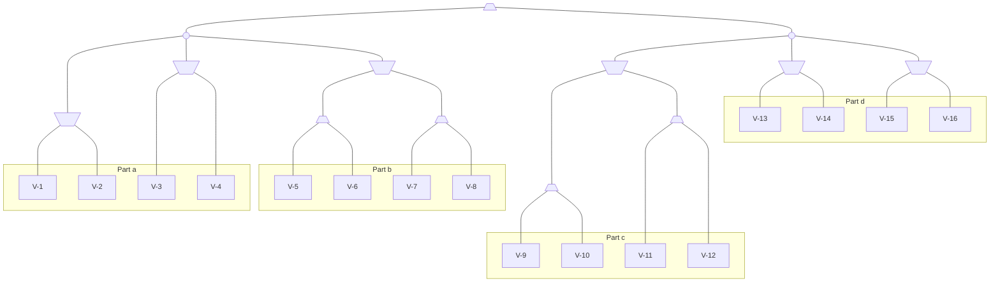

# Practice 4[^1]

For questions with circular bubbles ($\bigcirc$), you may select only one choice.

For questions with square checkboxes ($\square$), you may select one or more choices.

**Please show all work for credit.**

# MedianMiniMax (4 points)

You’re living in utopia! Despite living in utopia, you still believe that you need to maximize your utility in life, other people want to minimize your utility, and the world is a 0 sum game. But because you live in utopia, a benevolent social planner occasionally steps in and chooses an option that is a compromise. Essentially, the social planner (represented as the circle) is a median node that chooses the successor with median utility. Your struggle with your fellow citizens can be modelled as follows:

There are some nodes that we are sometimes able to prune. In each part, mark all of the terminal nodes such that **there exists a possible situation** for which the node **can be pruned**. In other words, you must consider **all** possible pruning situations. Assume that evaluation order is **left to right** and all $V_i$'s are distinct.

Note that as long as there exists ANY pruning situation (does not have to be the same situation for every node), you should mark the node as prunable. Also, alpha-beta pruning does not apply here, simply prune a sub-tree when you can reason that its value will not affect your final utility.

1. $\square$ $V_1$ $\square$ $V_2$ $\square$ $V_3$ $\square$ $V_4$ $\square$ None

2. $\square$ $V_5$ $\square$ $V_6$ $\square$ $V_7$ $\square$ $V_8$ $\square$ None

3. $\square$ $V_9$ $\square$ $V_10$ $\square$ $V_11$ $\square$ $V_12$ $\square$ None

4. $\square$ $V_13$ $\square$ $V_14$ $\square$ $V_15$ $\square$ $V_16$ $\square$ None

# How do you Value It(eration)? (8 points)

Fill out the following True/False questions.

1. Let $A$ be the set of all actions and $s$ the set of states for some MDP. Assuming that $|A| \ll |S|$, one iteration of value iteration is generally faster than one iteration of policy iteration that solves a linear system during policy evaluation$

$\bigcirc$ True

$\bigcirc$ False 

2. For any MDP, changing the discount factor does not affect the optimal policy for the MDP.

$\bigcirc$ True

$\bigcirc$ False 

The following problem will take place in various instances of a grid world MDP. Shaded cells represent walls. In all states, the agent has available actions $\uparrow, \downarrow, \leftarrow, \rightarrow $. Performing an action that would transition to an invalid state (outside the grid or into a wall) results in the agent remaining in its original state. In states with an arrow coming out, the agent has an *additional* action *EXIT*. In the event that the *EXIT* action is taken, the agent receives the labeled reward and ends the game in the terminal state $T$ . Unless otherwise stated, all other transitions receive no reward, and all transitions are deterministic.

For all parts of the problem, assume that value iteration begins with all states initialized to zero, i.e., $V_0(s) = 0 \forall s$. **Let the discount factor be $\gamma = \frac{1}{2}$ for all following parts.**

Suppose that we are performing value iteration on the grid world MDP below.

3. Fill in the optimal values for A and B in the given boxes.

$V^{\ast}(A)$
|                            |
| -------------------------- |
| __________________________ |

$V^{\ast}(B)$
|                            |
| -------------------------- |
| __________________________ |

4. After how many iterations $k$ will we have $V_k(s) = V^{\ast}(s)$ for all states $s$? If it never occurs, write “never". Write
your answer in the given box.

|                            |
| -------------------------- |
| __________________________ |

5. Suppose that we wanted to re-design the reward function. For which of the following new reward functions would the optimal policy **remain unchanged**? Let $R(s,a,s^{\prime})$ be the original reward function.

$\square$ $R(s,a,s^{\prime}) = 10R(s,a,s^{\prime})$

$\square$ $R(s,a,s^{\prime}) = 1 + R(s,a,s^{\prime})$

$\square$ $R(s,a,s^{\prime}) = R(s,a,s^{\prime})^2$

$\square$ $R(s,a,s^{\prime}) = -1$

$\square$ None

For the following problem, we add a new state in which we can take the *EXIT* action with a reward of $+x$.

6. For what values of $x$ is it *guaranteed* that our optimal policy $\pi^{\ast}$ has $\pi^{\ast}(C) = \leftarrow$? Write $\infty$ and $-\infty$ if there is no upper or lower bound, respectively. Write the upper and lower bounds in each respective box.

|                            |
| -------------------------- |
| __________________________ |

7. For what values of 𝑥 does value iteration take the **minimum** number of iterations $k$ to converge to $V^{\ast}$ for all states? Write $\infty$ and $-\infty$ if there is no upper or lower bound, respectively. Write the upper and lower bounds in each respective box.

|                            |
| -------------------------- |
| __________________________ |

8. Fill the box with value $k$, the **minimum** number of iterations until $V_k$ has converged to $V^{\ast}$ for all states.

|                            |
| -------------------------- |
| __________________________ |

[^1]: [Berkeley Computer Science](http://ai.berkeley.edu)
