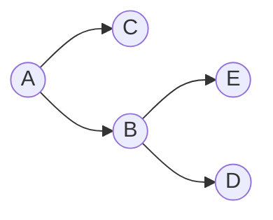
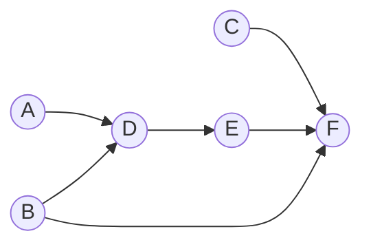
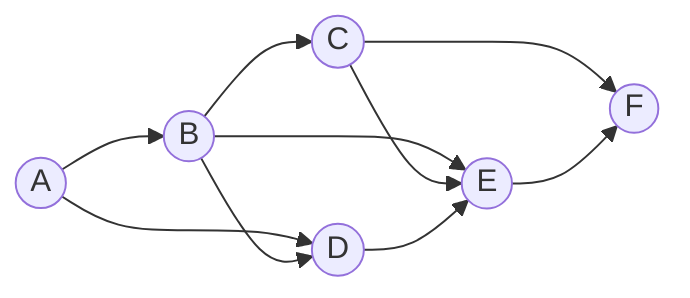

# Practice 6[^1]

For questions with circular bubbles ($\bigcirc$), you may select only one choice.

For questions with square checkboxes ($\square$), you may select one or more choices.

**Please show all work for credit.**

# Bayes Nets: Variable Elimination (9 points)



|        |  $P(A)$  |
| ------ | -------- |
|  $+a$  |   0.25   |
|  $-a$  |   0.75   |


|  $P(B \mid A)$ |   $+b$   |   $-b$   |
| -------------- | -------- | -------- |
|       $+a$     |   0.50   |   0.50   |
|       $-a$     |   0.25   |   0.75   |

|  $P(C \mid A)$ |   $+c$   |   $-c$   |
| -------------- | -------- | -------- |
|       $+a$     |   0.20   |   0.80   |
|       $-a$     |   0.60   |   0.40   |

|  $P(D \mid B)$ |   $+d$   |   $-d$   |
| -------------- | -------- | -------- |
|       $+b$     |   0.60   |   0.40   |
|       $-b$     |   0.80   |   0.20   |

|  $P(E \mid B)$ |   $+e$   |   $-e$   |
| -------------- | -------- | -------- |
|       $+b$     |   0.25   |   0.75   |
|       $-b$     |   0.10   |   0.90   |

Using the Bayes’ Net and conditional probability tables above, calculate the following quantities:

1. $P(+b \mid +a) = $  
```


```
2. $P(+a , +b) = $
```


```
3. $P(+a \mid +b) = $
```


```
Now we are going to consider variable elimination in the Bayes’ Net above.

4. Assume we have the evidence $+c$ and wish to calculate $P(E \mid +c)$. What factors do we have initially?
```


```
5. If we eliminate variable $B$, we create a new factor. What probability does that factor correspond to?
```


```
6. What is the equation to calculate the factor we create when eliminating variable $B$?
```


```
7. After eliminating variable $B$, what are the new set of factors? As in (5), write the probabilities that the factors represent. For each factor, also provide its size.
```


```
8. Now assume we have the evidence $-c$ and are trying to calculate $P(A \mid -c)$. What is the most efficient elimination ordering? If more than one ordering is most efficient, provide any one of them.
```


```
9. Once we have run variable elimination and have $f(A,-c)$ how do we calculate $P(+a \mid -c)$?
```


```
# Bayes Nets: Independence (3 points)

1. For the following graphs, explicitly state the minimum size set of edges that must be removed such that the corresponding independence relations are guaranteed to be true.

Marked the removed edges with an ‘X’ on the graphs.



$A \unicode{x2AEB} B \mid F$

$A \unicode{x2AEB} F \mid D$

$B \unicode{x2AEB} C$



$A \unicode{x2AEB} D \mid B$

$A \unicode{x2AEB} F \mid C$

$C \unicode{x2AEB} D \mid B$

You’re performing variable elimination over a Bayes Net with variables $A,B,C,D,E$. So far, you’ve finished joining over (but not summing out) $C$, when you realize you’ve lost the original Bayes Net!

Your current factors are $f(A), f(B), f(B,D), f(A,B,C,D,E)$. Note: these are factors, NOT joint distributions. You don’t know which variables are conditioned or unconditioned.

2. What’s the smallest number of edges that could have been in the original Bayes Net? Draw out one such Bayes Net below.

Number of edges =


3. What’s the largest number of edges that could have been in the original Bayes Net? Draw out one such Bayes Net below.

Number of edges =


[^1]: [Berkeley Computer Science](http://ai.berkeley.edu)
