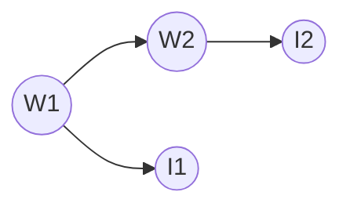

# Practice 7[^1]

For questions with circular bubbles ($\bigcirc$), you may select only one choice.

For questions with square checkboxes ($\square$), you may select one or more choices.

**Please show all work for credit.**

# Sampling in Bayes Nets (4 points)

We would like to analyze people’s ice cream eating habits on sunny and rainy days. Suppose we consider the weather, along with a person’s ice-cream eating, over the span of two days. We’ll have four random variables: $W_1$ and $W_2$ stand for the weather on days 1 and 2, which can either be rainy $R$ or sunny $S$, and the variables $I_1$ and $I_2$ represent whether or not the person ate ice cream on days 1 and 2, and take values $T$ (for truly eating ice cream) or $F$. We can model this as the following Bayes Net with these probabilities.



|        |  $P(W_1)$  |
| ------ | ---------- |
|   $S$  |    0.60    |
|   $R$  |    0.40    |


|   $W_1$  |   $W_2$  |  $P(W_2 \mid W_1)$ |
| -------- | -------- | ------------------ |
|     S    |     S    |         0.70       |
|     S    |     R    |         0.30       |
|     R    |     S    |         0.50       |
|     R    |     R    |         0.50       |

|   $W$  |   $I$  |  $P(I \mid W)$ |
| ------ | ------ | -------------- |
|    S   |    T   |       0.90     |
|    S   |    F   |       0.10     |
|    R   |    T   |       0.20     |
|    R   |    F   |       0.80     |

Suppose we produce the following samples of $(W_1, I_1, W_2, I_2)$ from the ice-cream model:

|     |     |     |     |
| --- | --- | --- | --- |
|  R  |  F  |  R  |  F  | 
|  R  |  F  |  R  |  F  |
|  S  |  F  |  S  |  T  |
|  S  |  T  |  S  |  T  |
|  S  |  T  |  R  |  F  |
|  R  |  F  |  R  |  T  |
|  S  |  T  |  S  |  T  |
|  S  |  T  |  S  |  T  |
|  S  |  T  |  R  |  F  | 
|  R  |  F  |  S  |  T  |

1. Using these samples, what is our estimate of $P(W_2 = R)$?

```


```

2. Cross off samples above which are rejected by rejection sampling if we’re trying to estimate $P(W_2 \mid I_1 = T, I_2 = F)$

Rejection sampling seems to be wasting a lot of effort, so we decide to switch to likelihood weighting. Assume we generate the
following six samples for $(W_1, I_1, W_2, I_2)$, given the evidence $I_1 = T$ and $I_2 = F$:

|     |     |     |     |
| --- | --- | --- | --- |
|  S  |  T  |  R  |  F  | 
|  R  |  T  |  R  |  F  |
|  S  |  T  |  R  |  F  | 
|  S  |  T  |  S  |  F  |
|  S  |  T  |  S  |  F  |
|  R  |  T  |  S  |  F  |

3. Calculate the weight of each sample.

```


```

4. Estimate $P(W_2 \mid I_1 = T, I_2 = F)$ using our likelihood weights from the previous part.

```


```

# VPI (5 points)

You are the latest contestant on Monty Hall’s game show, which has undergone a few changes over the years. In the game, there are 𝑛 closed doors: behind one door is a car $(U(\text{car}) = 1000)$, while the other $n-1$ doors each have a goat behind them $(U(\text{goat}) = 10)$. You are permitted to open exactly one door and claim the prize behind it.

You begin by choosing a door uniformly at random.

1. What is your expected utility?

```


```

2. After you choose a door but before you open it, Monty offers to open 𝑘 other doors, each of which are guaranteed to have a goat behind it. If you accept this offer, should you keep your original choice of a door, or switch to a new door? 

$EU(\text{keep})$:

```


```

$EU(\text{switch})$:

```


```

Action that achieves $MEU$:

```


```

3. What is the value of the information that Monty is offering you?

```


```

4. Monty is changing his offer!

After you choose your initial door, you are given the offer to choose any other door and open this second door. If you do, after you see what is inside the other door, you may switch your initial choice (to the newly opened door) or keep your initial choice.

What is the value of this new offer?

```


```

5. Monty is generalizing his offer: you can pay $$d^3$ to open $d$ doors as in the previous part. (Assume that $U(\$x)=x$.) You may now switch your choice to any of the open doors (or keep your initial choice). What is the largest value of $d$ for which it would be rational to accept the offer?

```


```
[^1]: [Berkeley Computer Science](http://ai.berkeley.edu)
