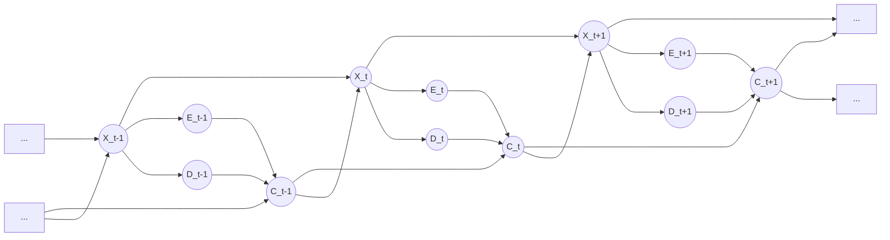
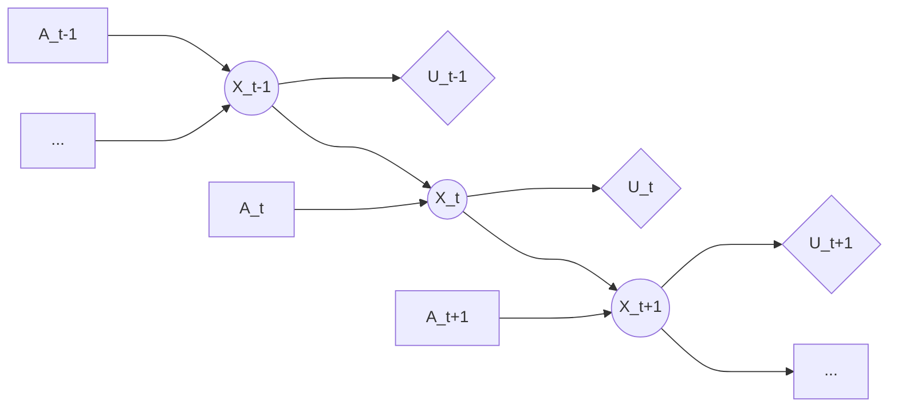

# Practice 8[^1]

For questions with circular bubbles ($\bigcirc$), you may select only one choice.

For questions with square checkboxes ($\square$), you may select one or more choices.

**Please show all work for credit.**

# We Are Getting Close... (8 points)

Mesut is trying to remotely control a car, which has gone out of his view. The unknown state of the car is represented by the random variable $X$. While Mesut can’t see the car itself, his high-tech sensors on the car provides two useful readings: an estimate (E) of the distance to the car in front, and a detection model (D) that detects if the car is headed into a wall. Using these two readings, Mesut applies the controls (C), which determine the velocity of the car by changing the acceleration. The Dynamic Bayes Net below describes the setup.

For the above DBN, complete the equations for performing updates. (Hint: think about the prediction update and obser- vation update equations in the forward algorithm for HMMs.)

Time elapse: **($i$)** = **($ii$)** **($iii$)** **($iv$)** $P(x_{t-1} \mid e_{0:t-1}, d_{0:t-1}, c_{0:t-1})$

1. **($i$)**

$\bigcirc$ $P(x_t)$

$\bigcirc$ $P(x_t \mid e_{0:t-1}, d_{0:t-1}, c_{0:t-1})$

$\bigcirc$ $P(e_t, d_t, c_t \mid e_{0:t-1}, d_{0:t-1}, c_{0:t-1})$

2. **($ii$)**

$\bigcirc$ $P(c_{0:t-1})$

$\bigcirc$ $P(x_{0:t-1}, c_{0:t-1})$

$\bigcirc$ $P(e_{0:t-1}, d_{0:t-1}, c_{0:t-1})$

$\bigcirc$ $P(e_{0:t}, d_{0:t}, c_{0:t})$

$\bigcirc$ 1

3. **($iii$)**

$\bigcirc$ $\sum_{x_{t-1}}$

$\bigcirc$ $\sum_{x_t}$

$\bigcirc$ $\max_{x_{t-1}}$

$\bigcirc$ $\max_{x_t}$

$\bigcirc$ 1

4. **($iv$)**

$\bigcirc$ $P(x_{t-1} \mid x_{t-2})$

$\bigcirc$ $P(x_{t-1},x_{t-2})$

$\bigcirc$ $P(x_t \mid e_{0:t-1}, d_{0:t-1}, c_{0:t-1})$

$\bigcirc$ $P(x_t \mid x_{t-1})$

$\bigcirc$ $P(x_t,x_{t-1})$

$\bigcirc$ $P(x_t,e_{0:t-1}, d_{0:t-1}, c_{0:t-1})$

$\bigcirc$ $P(x_t \mid x_{t-1}, c_{t-1})$

$\bigcirc$ $P(x_t,x_{t-1}, c_{t-1})$

$\bigcirc$ 1

Update to incorporate new evidence at time $t$:

$P(x_t \mid e_{0:t}, d_{0:t}, c_{0:t})=$ **($v$)** **($vi$)** **($vii$)** **Your choice for ($i$)**

5. **($v$)**

$\bigcirc$ $(P(c_t \mid c_{0:t-1}))^-1$

$\bigcirc$ $(P(e_t \mid e_{0:t-1})P(d_t \mid d_{0:t-1})P(c_t \mid c_{0:t-1}))^-1$

$\bigcirc$ $(P(e_t, d_t, c_t \mid e_{0:t-1}, d_{0:t-1}, c_{0:t-1}))^-1$

$\bigcirc$ $(P(e_{0:t-1} \mid e_t)(P(d_{0:t-1} \mid d_t)(P(c_{0:t-1} \mid c_t))^-1$

$\bigcirc$ $(P(e_{0:t-1}, d_{0:t-1}, c_{0:t-1} \mid e_t, d_t, c_t))^-1$

$\bigcirc$ 1

6. **($vi$)**

$\bigcirc$ $\sum_{x_{t-1}}$

$\bigcirc$ $\sum_{x_t}$

$\bigcirc$ $\sum_{x_{t-1}, x_t}$

$\bigcirc$ $\max_{x_{t-1}}$

$\bigcirc$ $\max_{x_t}$

$\bigcirc$ 1

7. **($iv$)**

$\square$ $P(x_t \mid e_t, d_t, c_t)$

$\square$ $P(x_t, e_t, d_t, c_t)$

$\square$ $P(x_t \mid e_t, d_t, c_t, c_{t-1})$

$\square$ $P(x_t, e_t, d_t, c_t, c_{t-1})$

$\square$ $P(e_t, d_t \mid x_t)P(c_t \mid e_t, d_t, c_{t-1})$

$\square$ $P(e_t, d_t, c_t \mid x_t)$

$\bigcirc$ 1 

Suppose we want to do the above updates in one step and use normalization to reduce computation. Select all the terms that are *not explicitly calculated* in this implementation.

DO **NOT** include the choices if their values are 1.

$\square$ **($ii$)** $\square$ **($iii$)** $\square$ **($iv$)** $\square$ **($v$)** $\square$ **($vi$)** $\square$ **($vii$)** $\bigcirc$ None of the above

# Planning ahead with HMMs (12 points)

Pacman is tired of using HMMs to estimate the location of ghosts. He wants to use HMMs to plan what actions to take in order to maximize his utility. Pacman uses the HMM (drawn to the right) of length $T$ to model the planning problem. In the HMM, $X_{1:T}$ is the sequence of hidden states of Pacman’s world, $A_{1:T}$ are actions Pacman can take, and $U_t$ is the utility Pacman receives at the particular hidden state $X_t$. Notice that there are no evidence variables, and utilities are not discounted.

The belief at time $t$ is defined as $B_t(X_t) = p(X_t \mid a_{1:t})$. The forward algorithm update has the following form:

$B_t(X_t) =$ **($ii$)** **($iii$)** $B_{t-1}(x_{t-1})$.

Complete the expression by choosing the option that fills in each blank.

1. **($i$)**

$\bigcirc$ $\max_{x_{t-1}}$

$\bigcirc$ $\sum_{x_{t-1}}$

$\bigcirc$ $\max_{x_t}$

$\bigcirc$ $\sum_{x_t}$

$\bigcirc$ 1

$\bigcirc$ None of the above

2. **($ii$)**

$\bigcirc$ $p(X_t \mid x_{t-1})$

$\bigcirc$ $p(X_t \mid x_{t-1})p(X_t \mid a_t)$

$\bigcirc$ $p(X_t)$

$\bigcirc$ $p(X_t \mid x_{t-1},a_t)$

$\bigcirc$ 1

$\bigcirc$ None of the above

Pacman would like to take actions $A_{1:T} that maximizes the expected sum of utilities, which has the following form:

$MEU _{1:T} =$ **($i$)** **($ii$)** **($iii$)** **($iv$)** **($v$)**

Complete the expression by choosing the option that fills in each blank.

3. **($iii$)**

$\bigcirc$ $\max_{a_{1:T}}$

$\bigcirc$ $\max_{a_T}$

$\bigcirc$ $\sum_{a_{1:T}}$

$\bigcirc$ $\sum_{a_T}$

$\bigcirc$ 1

$\bigcirc$ None of the above

4. **($iv$)**

$\bigcirc$ $\max_T$

$\bigcirc$ $\Pi_{t=1}^T$

$\bigcirc$ $\Sum_{t=1}^T$

$\bigcirc$ $\min_T$

$\bigcirc$ 1

$\bigcirc$ None of the above

5. **($v$)**

$\bigcirc$ $\sum_{x_t,a_t}$

$\bigcirc$ $\sum_{x_t}$

$\bigcirc$ $\sum_{a_t}$

$\bigcirc$ $\sum_{a_T}$

$\bigcirc$ 1

$\bigcirc$ None of the above

6. **($i$)**

$\bigcirc$ $p(x_t \mid x_{t-1}, a_t)$

$\bigcirc$ $p(a_t)$

$\bigcirc$ $B_t(x_t)$

$\bigcirc$ $B_T(x_T)$

$\bigcirc$ 1

$\bigcirc$ None of the above

7. **($i$)**

$\bigcirc$ $U_T$

$\bigcirc$ $\frac{1}{U_t}$

$\bigcirc$ $\frac{1}{U_T}$

$\bigcirc$ $U_t$

$\bigcirc$ 1

$\bigcirc$ None of the above

8. A greedy ghost now offers to tell Pacman the values of some of the hidden states. Pacman needs your help to figure out if the ghost’s information is useful. Assume that the transition function $p(x_t \mid x_{t-1},a_t)$ is not deterministic. **With respect to the utility** $U_t$, mark all that can be True:

$\square$ $\text{VPI}(X_{t-1} \mid X_{t-2}) > 0$

$\square$ $\text{VPI}(X_{t-2} \mid X_{t-1}) > 0$

$\square$ $\text{VPI}(X_{t-1} \mid X_{t-2}) = 0$

$\square$ $\text{VPI}(X_{t-2} \mid X_{t-1}) = 0$

$\square$ None of the above

Pacman notices that calculating the beliefs under this model is very slow using exact inference. He therefore decides to try out various particle filter methods to speed up inference. Order the following methods by how accurate their estimate of $B_T(X_T)$ is? If different methods give an equivalently accurate estimate, mark them as the same number.  One is most accurate and four is least accurate.

9. Exact inference $\bigcirc$ 1 $\bigcirc$ 2 $\bigcirc$ 3 $\bigcirc$ 4

10. Particle filtering with no resampling $\bigcirc$ 1 $\bigcirc$ 2 $\bigcirc$ 3 $\bigcirc$ 4

11. Particle filtering with resampling before every time elapse $\bigcirc$ 1 $\bigcirc$ 2 $\bigcirc$ 3 $\bigcirc$ 4

12. Particle filtering with resampling before every other time elapse $\bigcirc$ 1 $\bigcirc$ 2 $\bigcirc$ 3 $\bigcirc$ 4

[^1]: [Berkeley Computer Science](http://ai.berkeley.edu)
