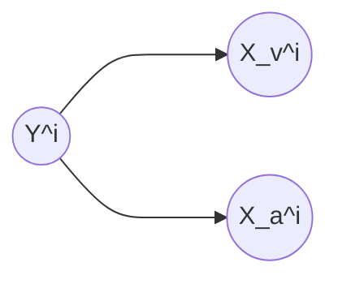
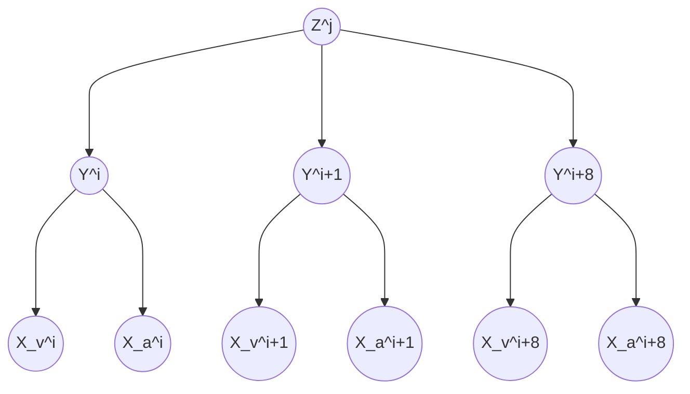

# Practice 9[^1]

For questions with circular bubbles ($\bigcirc$), you may select only one choice.

For questions with square checkboxes ($\square$), you may select one or more choices.

**Please show all work for credit.**

# Naive Bayes: Pacman or Ghost? (4 points)

You are standing by an exit as either Pacmen or ghosts come out of it. Every time someone comes out, you get two observations: a visual one and an auditory one, denoted by the random variables $X_v$ and $X_a$, respectively. The visual observation informs you that the individual is either a Pacman ($X_v=1$) or a ghost ($X_v=0$). The auditory observation $X_a$ is defined analogously. Your observations are a noisy measurement of the individual’s true type, which is denoted by $Y$ . After the indiviual comes out, you find out what they really are: either a Pacman ($Y=1$) or a ghost ($Y=0$). You have logged your observations and the true types of the first 20 individuals:

| individual $i$             | 0 | 1 | 2 | 3 | 4 | 5 | 6 | 7 | 8 | 9 | 10 | 11 | 12 | 13 | 14 | 15 | 16 | 17 | 18 | 19 |
| -------------------------- | - | - | - | - | - | - | - | - | - | - | -- | -- | -- | -- | -- | -- | -- | -- | -- | -- |
| first observation $X_v^i$  | 0 | 0 | 1 | 0 | 1 | 0 | 0 | 1 | 1 | 1 | 0  | 1  | 1  | 0  | 1  | 1  | 1  | 0  | 0  | 0  |
| second observation $X_a^i$ | 0 | 0 | 0 | 0 | 0 | 0 | 0 | 0 | 0 | 0 | 0  | 1  | 1  | 0  | 0  | 0  | 0  | 0  | 0  | 0  |
| individual’s type $Y^i$    | 0 | 0 | 0 | 0 | 0 | 0 | 0 | 1 | 1 | 1 | 1  | 1  | 1  | 1  | 1  | 1  | 1  | 0  | 0  | 0  |

The superscript $i$ denotes that the datum is the $i$th one. Now, the individual with $i=20$ comes out, and you want to predict
the individual’s type $Y^{20}$ given that you observed $X_v^{20} = 1$ and $X_a^{20} = 1$.

Assume that the types are independent, and that the observations are independent conditioned on the type. You can model this using naïve Bayes, with $x_v^i$ and $x_a^i$ as the features and $Y^i$ as the labels. Assume the probability distributions take
on the following form:

$$
\begin{equation}
  P(X_v^i = x_v \mid Y^i = y) = 
    \begin{cases}
      p_v & \text{ if } x_v = y \\
      1-p_v & \text{ if } x_v =\ne y \\
    \end{cases}       
\end{equation}
$$

$$
\begin{equation}
  P(X_a^i = x_a \mid Y^i = y) = 
    \begin{cases}
      p_a & \text{ if } x_a = y \\
      1-p_a & \text{ if } x_a =\ne y \\
    \end{cases}       
\end{equation}
$$

$$
P(Y^u = 1) = q
$$

for $p_v, p_a, q \in \[0,1\]$ and $i \in \mathbb{N}$

1. What’s the maximum likelihood estimate of $p_v$, $p_a$ and $q$?

$p_v=$ `                                   `

$p_a=$ `                                   `

$q=$ `                                   `

2. What is the probability that the next individual is Pacman given your observations? Express your answer in terms of the parameters $p_v$, $p_a$ and $q$ (you might not need all of them).

$P(Y^{20} = 1 \mid X_v^{20} = 1, X_a^{20} = 1)=$ `                                            `

Now, assume that you are given additional information: you are told that the individuals are actually coming out of a bus that just arrived, and each bus carries *exactly* 9 individuals. Unlike before, the types of every 9 consecutive individuals are *conditionally* independent given the bus type, which is denoted by $Z$. Only after all of the 9 individuals have walked out, you find out the bus type: one that carries mostly Pacmans ($Z=1$) or one that carries mostly ghosts ($Z=0$). Thus, you only know the bus type in which the first 18 individuals came in:

| individual $i$             | 0 | 1 | 2 | 3 | 4 | 5 | 6 | 7 | 8 |   | 9 | 10 | 11 | 12 | 13 | 14 | 15 | 16 | 17 |   | 18 | 19 |
| -------------------------- | - | - | - | - | - | - | - | - | - | - | - | -- | -- | -- | -- | -- | -- | -- | -- | - | -- | -- |
| first observation $X_v^i$  | 0 | 0 | 1 | 0 | 1 | 0 | 0 | 1 | 1 |   | 1 | 0  | 1  | 1  | 0  | 1  | 1  | 1  | 0  |   | 0  | 0  |
| second observation $X_a^i$ | 0 | 0 | 0 | 0 | 0 | 0 | 0 | 0 | 0 |   | 0 | 0  | 1  | 1  | 0  | 0  | 0  | 0  | 0  |   | 0  | 0  |
| individual’s type $Y^i$    | 0 | 0 | 0 | 0 | 0 | 0 | 0 | 1 | 1 |   | 1 | 1  | 1  | 1  | 1  | 1  | 1  | 1  | 0  |   | 0  | 0  |

| bus $j$        | 0 |   | 1 |   |   |
| -------------- | - | - | - | - | - |
| bus type $Z^j$ | 0 |   | 1 |   |   |

You can model this using a variant of naïve bayes, where now 9 consecutive labels $𝑌^i, \cdots , Y^{i+8}$ are *conditionally* independent given the bus type $Z^j$, for bus $j$ and individual $i = 9j$. Assume the probability distributions take on the following form:

$$
\begin{equation}
  P(X_v^i = x_v \mid Y^i = y) = 
    \begin{cases}
      p_v & \text{ if } x_v = y \\
      1-p_v & \text{ if } x_v =\ne y \\
    \end{cases}       
\end{equation}
$$

$$
\begin{equation}
  P(X_a^i = x_a \mid Y^i = y) = 
    \begin{cases}
      p_a & \text{ if } x_a = y \\
      1-p_a & \text{ if } x_a =\ne y \\
    \end{cases}       
\end{equation}
$$

$$
\begin{equation}
  P(Y^i = 1 \mid Z^j = z) = 
    \begin{cases}
      q_0 & \text{ if } z = 0 \\
      q_1 & \text{ if } z = 1 \\
    \end{cases}       
\end{equation}
$$

$$
P(Z^j = 1) = r
$$

for $p, q_0, q_1, r \in \[0,1\]$ and $i,j \in \mathbb{N}$

3. What’s the maximum likelihood estimate of $q_0$, $q_1$ and $r$?

$q_0=$ `                                   `

$q_1=$ `                                   `

$r=$ `                                   `

4. Compute the following joint probability. Simplify your answer as much as possible and express it in terms of the parameters $p_v$, $p_a$, $q_0$, $q_1$ and $r$ (you might not need all of them).

$P(Y^{20} = 1, X_v^{20} = 1, X_a^{20} = 1, Y^{19} = 1, Y^{18} = 1)=$ `  

# Linear Separability (3 points)

For each of the datasets represented by the graphs below, please select the feature maps for which the perceptron algorithm can perfectly classify the data.

Each data point is in the form ($x_1, x_2$), and has some label $Y$ , which is either a 1 (dot) or −1 (cross).

1. Graph 1

$$
\square
\begin{bmatrix}
x_1 &
x_2 &
1
\end{bmatrix}
$$

$$
\square
\begin{bmatrix}
x_1 &
x_2 &
x_1^2
\end{bmatrix}
$$

$$
\square
\begin{bmatrix}
x_1 &
x_2 &
|x_1|
\end{bmatrix}
$$

$$
\square
\begin{bmatrix}
x_1 &
x_2 &
Y
\end{bmatrix}
$$

$$
\square
\begin{bmatrix}
x_1 &
x_2
\end{bmatrix}
$$

2. Graph 2

$$
\square
\begin{bmatrix}
x_1 &
x_2 &
1
\end{bmatrix}
$$

$$
\square
\begin{bmatrix}
x_1 &
x_2 &
x_1^2
\end{bmatrix}
$$

$$
\square
\begin{bmatrix}
x_1 &
x_2 &
|x_1|
\end{bmatrix}
$$

$$
\square
\begin{bmatrix}
x_1 &
x_2 &
Y
\end{bmatrix}
$$

$$
\square
\begin{bmatrix}
x_1 &
x_2
\end{bmatrix}
$$

3. Graph 3

$$
\square
\begin{bmatrix}
x_1 &
x_2 &
1
\end{bmatrix}
$$

$$
\square
\begin{bmatrix}
x_1 &
x_2 &
x_1^2
\end{bmatrix}
$$

$$
\square
\begin{bmatrix}
x_1 &
x_2 &
|x_1|
\end{bmatrix}
$$

$$
\square
\begin{bmatrix}
x_1 &
x_2 &
Y
\end{bmatrix}
$$

$$
\square
\begin{bmatrix}
x_1 &
x_2
\end{bmatrix}
$$

[^1]: [Berkeley Computer Science](http://ai.berkeley.edu)
