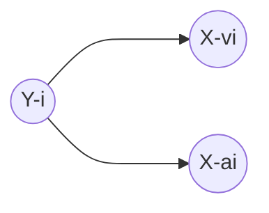

# Practice 9[^1]

For questions with circular bubbles ($\bigcirc$), you may select only one choice.

For questions with square checkboxes ($\square$), you may select one or more choices.

**Please show all work for credit.**

# Naive Bayes: Pacman or Ghost? (4 points)

You are standing by an exit as either Pacmen or ghosts come out of it. Every time someone comes out, you get two observations: a visual one and an auditory one, denoted by the random variables $X_v$ and $X_a$, respectively. The visual observation informs you that the individual is either a Pacman ($X_v=1$) or a ghost ($X_v=0$). The auditory observation $X_a$ is defined analogously. Your observations are a noisy measurement of the individual’s true type, which is denoted by $Y$ . After the indiviual comes out, you find out what they really are: either a Pacman ($Y=1$) or a ghost ($Y=0$). You have logged your observations and the true types of the first 20 individuals:

| individual $i$             | 0 | 1 | 2 | 3 | 4 | 5 | 6 | 7 | 8 | 9 | 10 | 11 | 12 | 13 | 14 | 15 | 16 | 17 | 18 | 19 |
| -------------------------- | - | - | - | - | - | - | - | - | - | - | -- | -- | -- | -- | -- | -- | -- | -- | -- | -- |
| firstobservation $X_v^i$   | 0 | 0 | 1 | 0 | 1 | 0 | 0 | 1 | 1 | 1 | 0  | 1  | 1  | 0  | 1  | 1  | 1  | 0  | 0  | 0  |
| secondobservation $X_a^i$  | 0 | 0 | 0 | 0 | 0 | 0 | 0 | 0 | 0 | 0 | 0  | 1  | 1  | 0  | 0  | 0  | 0  | 0  | 0  | 0  |
| individual’stype $Y^i$     | 0 | 0 | 0 | 0 | 0 | 0 | 0 | 1 | 1 | 1 | 1  | 1  | 1  | 1  | 1  | 1  | 1  | 0  | 0  | 0  |

The superscript $i$ denotes that the datum is the $i$th one. Now, the individual with $i=20$ comes out, and you want to predict
the individual’s type $Y^{20}$ given that you observed $X_v^{20} = 1$ and $X_a^{20} = 1$.

Assume that the types are independent, and that the observations are independent conditioned on the type. You can model this using naïve Bayes, with $x_v^i$ and $x_a^i$ as the features and $Y^i$ as the labels. Assume the probability distributions take
on the following form:

$$
\begin{equation}
  P(X_v^i = x_v \mid Y^i = y) = 
    \begin{cases}
      p_v & \text{ if } x_v = y \\
      1-p_v & \text{ if } x_v =\ne y \\
    \end{cases}       
\end{equation}
$$

$$
\begin{equation}
  P(X_a^i = x_a \mid Y^i = y) = 
    \begin{cases}
      p_a & \text{ if } x_a = y \\
      1-p_a & \text{ if } x_a =\ne y \\
    \end{cases}       
\end{equation}
$$

for $p_v, p_a, q \in \[0,1\]$ and $i \in \mathbb{N}$

1. What’s the maximum likelihood estimate of $p_v$, $p_a$ and $q$?

$p_v=$ `                                   `

$p_a=$ `                                   `

$q=$ `                                   `

2. What is the probability that the next individual is Pacman given your observations? Express your answer in terms of the parameters $p_v$, $p_a$ and $q$ (you might not need all of them).

$P(Y^{20} = 1 \mid X_v^{20}, X_a^{20})=$ `                                            `

# Linear Separability (3 points)

[^1]: [Berkeley Computer Science](http://ai.berkeley.edu)
