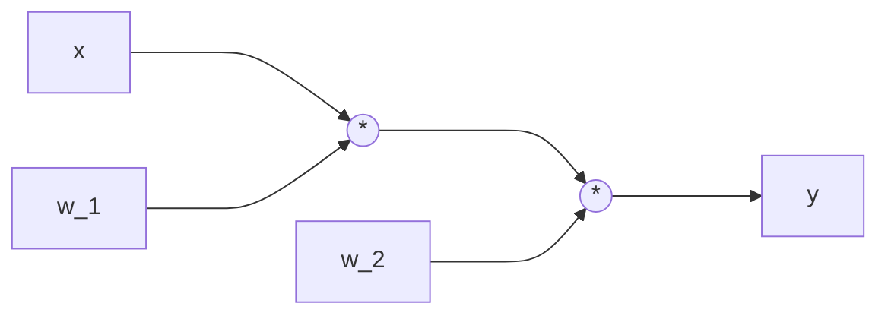
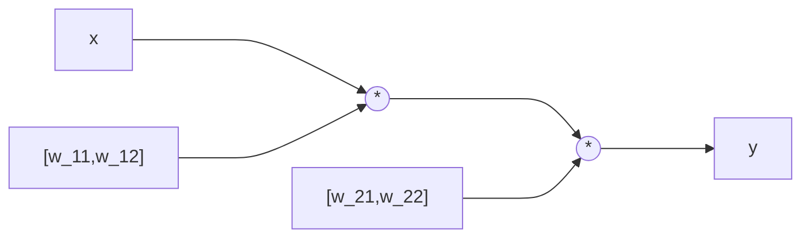
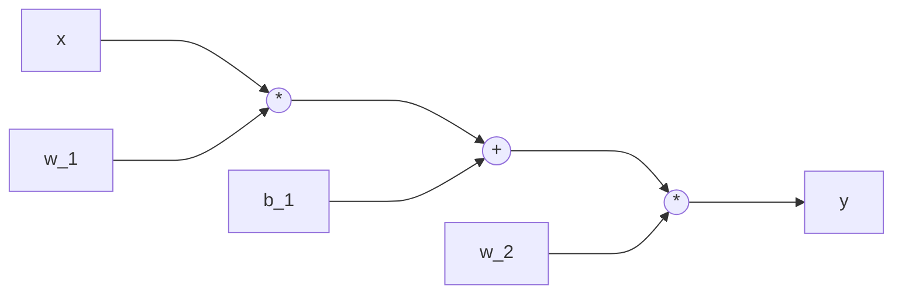
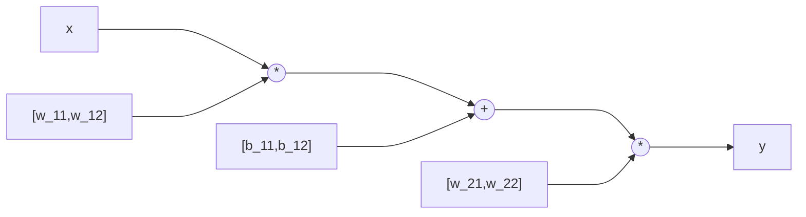
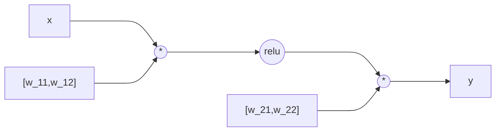
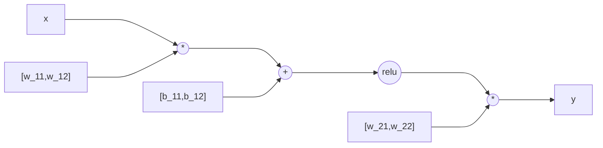
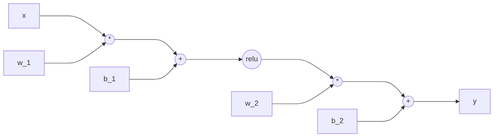
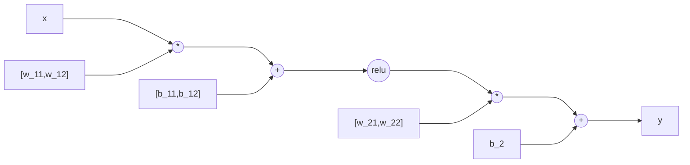

# Practice 10[^1]

For questions with circular bubbles ($\bigcirc$), you may select only one choice.

For questions with square checkboxes ($\square$), you may select one or more choices.

**Please show all work for credit.**

# Machine Learning: Potpourri (11 points)

1. What it the **minimum** number of parameters needed to fully model a joint distribution $P(Y, F_1, F_2, \cdots, F_n)$ over label $Y$
and $n$ features $F_i$? Assume binary class where each feature can possibly take on $k$ distinct values.

```

```

2. Under the **Naive Bayes** assumption, what is the **minimum** number of parameters needed to model a joint distribution
$P(Y, F_1, F_2, \cdots, F_n)$ over label $Y$ and $n$ features $F_i$? Assume binary class where each feature can take on $k$ distinct values.

```

```

3. You suspect that you are overfitting with your Naive Bayes with Laplace Smoothing. How would you adjust the strength $k$ in Laplace Smoothing?

$\bigcirc$ Increase $k$ 

$\bigcirc$ Decrease $k$

4.

$\square$ Increase training error 

$\square$ Increase validation error

$\square$ Decrease training error

$\square$ Decrease validation error

5. It is possible for the perceptron algorithm to never terminate on a dataset that is linearly separable in its feature space.

$\bigcirc$ True 

$\bigcirc$ False

6. If the perceptron algorithm terminates, then it is guaranteed to find a max-margin separating decision boundary.

$\bigcirc$ True 

$\bigcirc$ False


7. In binary perceptron where the initial weight vector is $\vec{0}$, the final weight vector can be written as a linear combination of
the training data feature vectors.

$\bigcirc$ True 

$\bigcirc$ False


8. For binary class classification, logistic regression produces a linear decision boundary.

$\bigcirc$ True 

$\bigcirc$ False


9. In the binary classification case, logistic regression is exactly equivalent to a single-layer neural network with a sigmoid activation and the cross-entropy loss function.

$\bigcirc$ True 

$\bigcirc$ False


10. You train a linear classifier on 1,000 training points and discover that the training accuracy is only 50%. Which of the following, if done in isolation, has a good chance of improving your training accuracy?

$\square$ Add novel features 

$\square$ Train on more data

11. You now try training a neural network but you find that the training accuracy is still very low. Which of the following, if done in isolation, has a good chance of improving your training accuracy?

$\square$ Add more hidden layers

$\square$ Add more units to the hidden layers

# Neural Networks: Representation (6 points)

**$G_1$:**



**$H_1$:**



**$G_2$:**



**$H_2$:**



**$G_3$:**



**$H_3$:**

```mermaid

```

**$G_4$:**

```mermaid
flowchart LR
    id1[x] ---> id3
    id2[w_1] ---> id3
    id3((*)) ---> id5
    id4[b_1] ---> id5
    id5((+)) ---> id9
    id9((relu)) ---> id7
    id6[w_2] ---> id7
    id7((*)) ---> id8
    id8[y]
```

**$H_4$:**



**$G_5$:**



**$H_5$:**



For each of the piecewise-linear functions below, mark all networks from the list above that can represent the function **exactly** on the range $x \in (-\infty, infty)$. In the networks above, 𝑟𝑒𝑙𝑢 denotes the element-wise ReLU nonlinearity: $\text{relu}(z) = \text{max}(0,z). The networks $G_i$ use 1-dimensional layers, while the networks $H_i$ have some 2-dimensional intermediate layers.

1. Graph 1


$\square$ $G_1$ $\square$ $H_1$  
$\square$ $G_2$ $\square$ $H_2$  
$\square$ $G_3$ $\square$ $H_3$  
$\square$ $G_4$ $\square$ $H_4$  
$\square$ $G_5$ $\square$ $H_5$  
$\bigcirc$ None of the above  

2. Graph 2


$\square$ $G_1$ $\square$ $H_1$  
$\square$ $G_2$ $\square$ $H_2$  
$\square$ $G_3$ $\square$ $H_3$  
$\square$ $G_4$ $\square$ $H_4$  
$\square$ $G_5$ $\square$ $H_5$  
$\bigcirc$ None of the above  

3. Graph 3


$\square$ $G_1$ $\square$ $H_1$  
$\square$ $G_2$ $\square$ $H_2$  
$\square$ $G_3$ $\square$ $H_3$  
$\square$ $G_4$ $\square$ $H_4$  
$\square$ $G_5$ $\square$ $H_5$  
$\bigcirc$ None of the above  

4. Graph 4


$\square$ $G_1$ $\square$ $H_1$  
$\square$ $G_2$ $\square$ $H_2$  
$\square$ $G_3$ $\square$ $H_3$  
$\square$ $G_4$ $\square$ $H_4$  
$\square$ $G_5$ $\square$ $H_5$  
$\bigcirc$ None of the above  

5. Graph 5


$\square$ $G_1$ $\square$ $H_1$  
$\square$ $G_2$ $\square$ $H_2$  
$\square$ $G_3$ $\square$ $H_3$  
$\square$ $G_4$ $\square$ $H_4$  
$\square$ $G_5$ $\square$ $H_5$  
$\bigcirc$ None of the above  

6. Graph 6


$\square$ $G_1$ $\square$ $H_1$  
$\square$ $G_2$ $\square$ $H_2$  
$\square$ $G_3$ $\square$ $H_3$  
$\square$ $G_4$ $\square$ $H_4$  
$\square$ $G_5$ $\square$ $H_5$  
$\bigcirc$ None of the above  

[^1]: [Berkeley Computer Science](http://ai.berkeley.edu)
