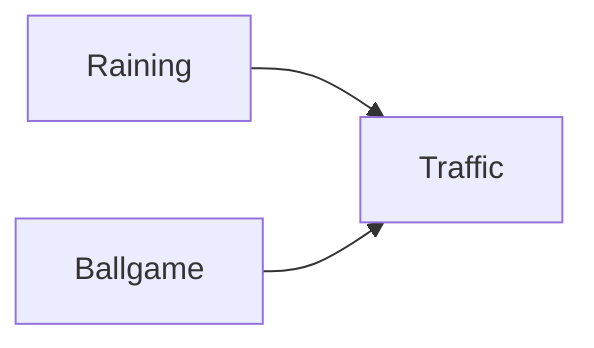
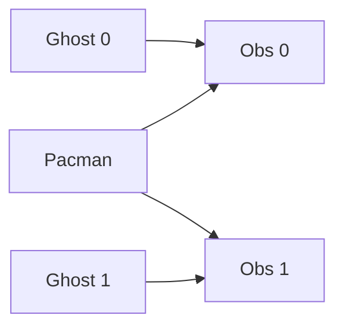
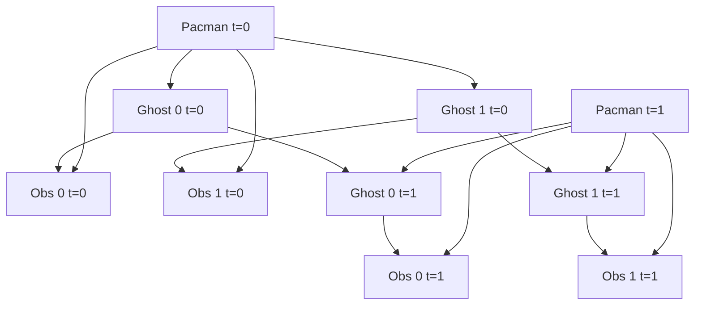
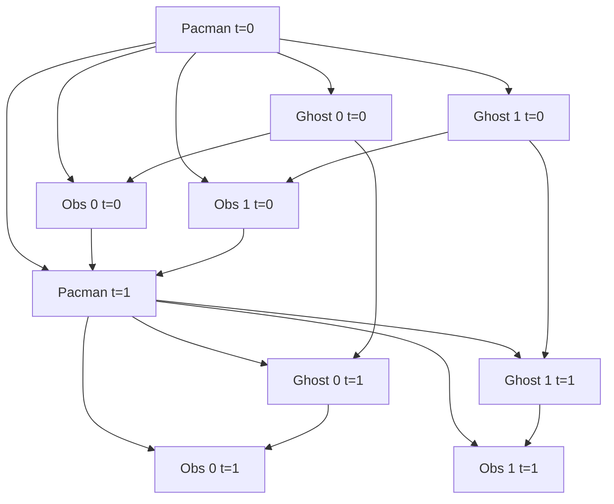
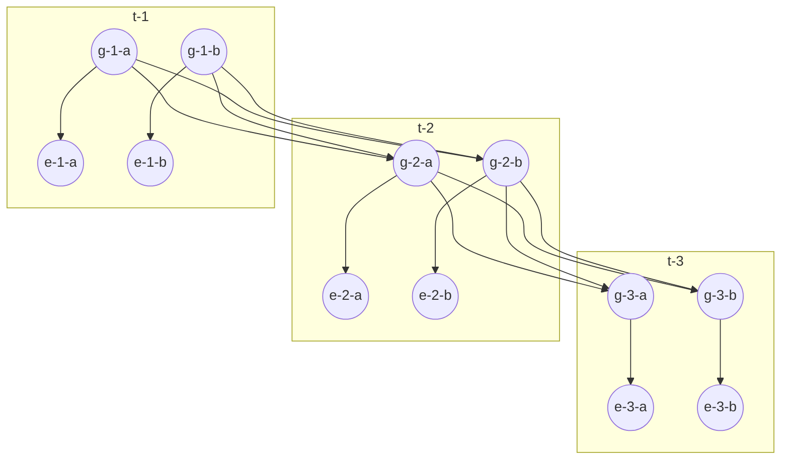

# Project 4: Ghostbusters[^1]

## Introduction

Pacman spends his life running from ghosts, but things were not always so. Legend has it that many years ago, Pacman’s great grandfather Grandpac learned to hunt ghosts for sport. However, he was blinded by his power and could only track ghosts by their banging and clanging.

In this project, you will design Pacman agents that use sensors to locate and eat invisible ghosts. You’ll advance from locating single, stationary ghosts to hunting packs of multiple moving ghosts with ruthless efficiency.

As in project 1, this project includes an autograder for you to grade your answers on your machine. This can be run on all questions with the command:

```sh
python autograder.py
```

It can be run for one particular question, such as q2, by:

```sh
python autograder.py -q q2
```

It can be run for one particular test by commands of the form:

```sh
python autograder.py -t test_cases/q1/1-ObsProb
```

The code for this project is located in this repository.

### Files you will edit

|                             |                                                                     |
| --------------------------- | ------------------------------------------------------------------- |
| bustersAgents.py            |	Agents for playing the Ghostbusters variant of Pacman.              |
| inference.py                |	Code for tracking ghosts over time using their sounds.              |
| factorOperations.py         |	Operations to compute new joint or magrinalized probability tables. |

### Files you might want to review

|                                        |                                   |
| -------------------------------------- | --------------------------------- |
| bayesNet.py                            |	The BayesNet and Factor classes. |

### Supporting files you can ignore

|                                         |                                                                                         |
| --------------------------------------- | --------------------------------------------------------------------------------------- |
| busters.py                              |	The main entry to Ghostbusters (replacing Pacman.py).                                   |
| bustersGhostAgents.py                   |	New ghost agents for Ghostbusters.                                                      |
| distanceCalculator.py	                  | Computes maze distances, caches results to avoid re-computing.                          |
| game.py                                 |	Inner workings and helper classes for Pacman.                                           |
| ghostAgents.py                          |	Agents to control ghosts.                                                               |
| graphicsDisplay.py                      |	Graphics for Pacman.                                                                    |
| graphicsUtils.py                        |	Support for Pacman graphics.                                                            |
| keyboardAgents.py                       |	Keyboard interfaces to control Pacman.                                                  |
| layout.py                               |	Code for reading layout files and storing their contents.                               |
| util.py                                 |	Utility functions.                                                                      |

### Files to Edit and Submit

You will fill in portions of `bustersAgents.py`, `inference.py`, and `factorOperations.py` during the assignment. Once you have completed the assignment, you will submit these files. Please do not change the other files in this distribution or submit any other files.

### Evaluation

Your code will be autograded for technical correctness. Please do not change the names of any provided functions or classes within the code, or you will wreak havoc on the autograder. However, the correctness of your implementation – not the autograder’s judgements – will be the final judge of your score. If necessary, I will review and grade assignments individually to ensure that you receive due credit for your work.

### Academic Dishonesty

I trust you to submit your own work only. If you do not, I will pursue the consequences outlined in the syllabus.

### Getting Help

You are not alone! If you find yourself stuck on something, contact me or someone in your community (the 50ft rule applies). Office hours and class are there for your support; please use them. If you can’t make the office hours, let me know and I will schedule more. I want these projects to be rewarding and instructional, not frustrating and demoralizing. But, I don’t know when or how to help unless you ask.

### Discussion

Please be careful not to post spoilers.

## Ghostbusters and Bayes Nets

In this version of Ghostbusters, the goal is to hunt down scared but invisible ghosts. Pacman, ever resourceful, is equipped with sonar (ears) that provides noisy readings of the Manhattan distance to each ghost. The game ends when Pacman has eaten all the ghosts. To start, try playing a game yourself using the keyboard.

```sh
python busters.py
```

The blocks of color indicate where the each ghost could possibly be, given the noisy distance readings provided to Pacman. The noisy distances at the bottom of the display are always non-negative, and always within 7 of the true distance. The probability of a distance reading decreases exponentially with its difference from the true distance.

Your primary task in this project is to implement inference to track the ghosts. For the keyboard based game above, a crude form of inference was implemented for you by default: all squares in which a ghost could possibly be are shaded by the color of the ghost. Naturally, we want a better estimate of the ghost’s position. Fortunately, Bayes Nets provide us with powerful tools for making the most of the information we have. Throughout the rest of this project, you will implement algorithms for performing both exact and approximate inference using Bayes Nets. The project is challenging, so we do encouarge you to start early and seek help when necessary.

While watching and debugging your code with the autograder, it will be helpful to have some understanding of what the autograder is doing. There are 2 types of tests in this project, as differentiated by their `.test` files found in the subdirectories of the `test_cases` folder. For tests of class `DoubleInferenceAgentTest`, you will see visualizations of the inference distributions generated by your code, but all Pacman actions will be pre-selected according to the actions of the staff implementation. This is necessary to allow comparision of your distributions with the staff’s distributions. The second type of test is `GameScoreTest`, in which your `BustersAgent` will actually select actions for Pacman and you will watch your Pacman play and win games.

For this project, it is possible sometimes for the autograder to time out if running the tests with graphics. To accurately determine whether or not your code is efficient enough, you should run the tests with the `--no-graphics` flag. If the autograder passes with this flag, then you will receive full points, even if the autograder times out with graphics.

### Bayes Nets and Factors

First, take a look at `bayesNet.py` to see the classes you’ll be working with – `BayesNet` and Factor. You can also run this file to see an example `BayesNet` and associated `Factors`: `python bayesNet.py`.

You should look at the `printStarterBayesNet` function – there are helpful comments that can make your life much easier later on.

The Bayes Net created in this function is shown below:



A summary of the terminology is given below:

### Bayes Net

This is a representation of a probabilistic model as a directed acyclic graph and a set of conditional probability tables, one for each variable, as shown in lecture. The Traffic Bayes Net above is an example.

### Factor

This stores a table of probabilities, although the sum of the entries in the table is not necessarily 1. A factor is of the general form $f(X_1, \cdots , X_m, y_1, \cdots ,y_n | Z_1, \cdots, Z_p, w_1, \cdots , w_q)$. Recall that lower case variables have already been assigned. For each possible assignment of values to the $X_i$ and $Z_j$ variables, the factor stores a single number. The $Z_j$ and $w_k$ variables are said to be conditioned while the $X_i$ and $y_j$ variables are unconditioned.
  
### Conditional Probability Table (CPT)

This is a factor satisfying two properties:

1. Its entries must sum to 1 for each assignment of the conditional variables.
2. There is exactly one unconditioned variable. The Traffic Bayes Net stores the following CPTs: 
 - $P(\text{Raining})$
 - $P(\text{Ballgame})$
 - $(P(\text{Traffic} | \text{Ballgame}, \text{Raining})$

## Question 1 (2 points): Bayes Net Structure

Implement the `constructBayesNet` function in `inference.py`. It constructs an empty Bayes Net with the structure described below. A Bayes Net is incomplete without the actual probabilities, but factors are defined and assigned by staff code separately; you don’t need to worry about it. If you are curious, you can take a look at an example of how it works in `printStarterBayesNet` in `bayesNet.py`. Reading this function can also be helpful for doing this question.

The simplified ghost hunting world is generated according to the following Bayes net:



Don’t worry if this looks complicated! We’ll take it step by step. As described in the code for `constructBayesNet`, we build the empty structure by listing all of the variables, their values, and the edges between them. This figure shows the variables and the edges, but what about their domains?

- Add variables and edges based on the diagram.
- Pacman and the two ghosts can be anywhere in the grid (we ignore walls for this). Add all possible position tuples for these.
- Observations here are non-negative, equal to Manhattan distances of Pacman to ghosts $\pm$ noise.
Grading: To test and debug your code, run

```sh
python autograder.py -q q1
```

## Question 2 (3 points): Join Factors

Implement the `joinFactors` function in `factorOperations.py`. It takes in a list of `Factor`s and returns a new `Factor` whose probability entries are the product of the corresponding rows of the input `Factor`s.

`joinFactors` can be used as the product rule, for example, if we have a factor of the form $P(X \mid Y)$ and another factor of the form $P(Y)$ , then joining these factors will yield $P(X,Y)$ . So, `joinFactors` allows us to incorporate probabilities for conditioned variables (in this case, $Y$). However, you should not assume that `joinFactors` is called on probability tables – it is possible to call `joinFactors` on `Factor`s whose rows do not sum to 1.

Grading: To test and debug your code, run

```sh
python autograder.py -q q2
```

It may be useful to run specific tests during debugging, to see only one set of factors print out. For example, to only run the first test, run:

```sh
python autograder.py -t test_cases/q2/1-product-rule
```

Hints and Observations:

- Your `joinFactors` should return a new `Factor`.
- Here are some examples of what `joinFactors` can do:
 - `joinFactors` $(P(X∣Y),P(Y))=P(X,Y)$ 
 - `joinFactors` $(P(V,W∣X,Y,Z),P(X,Y∣Z))=P(V,W,X,Y∣Z)$ 
 - `joinFactors` $(P(X∣Y,Z),P(Y))=P(X,Y∣Z)$ 
 - `joinFactors` $(P(V∣W),P(X∣Y),P(Z))=P(V,X,Z∣W,Y)$ 
- For a general `joinFactors` operation, which variables are unconditioned in the returned `Factor`? Which variables are conditioned?
- `Factor`s store a `variableDomainsDict`, which maps each variable to a list of values that it can take on (its domain). A `Factor` gets its variableDomainsDict from the `BayesNet` from which it was instantiated. As a result, it contains all the variables of the `BayesNet`, not only the unconditioned and conditioned variables used in the `Factor`. For this problem, you may assume that all the input `Factor`s have come from the same `BayesNet`, and so their `variableDomainsDicts` are all the same.

## Question 3 (2 points): Eliminate (not ghosts yet)

Implement the `eliminate` function in `factorOperations.py`. It takes a `Factor` and a variable to eliminate and returns a new `Factor` that does not contain that variable. This corresponds to summing all of the entries in the `Factor` which only differ in the value of the variable being eliminated.

Grading: To test and debug your code, run

```sh
python autograder.py -q q3
```

It may be useful to run specific tests during debugging, to see only one set of factors print out. For example, to only run the first test, run:

```sh
python autograder.py -t test_cases/q3/1-simple-eliminate
```

Hints and Observations:

- Your `eliminate` should return a new `Factor`.
- `eliminate` can be used to marginalize variables from probability tables. For example:
 - `eliminate` $(P(X,Y∣Z),Y)=P(X∣Z)$
 - `eliminate` $(P(X,Y∣Z),X)=P(Y∣Z)$
- For a general eliminate operation, which variables are unconditioned in the returned Factor? Which variables are conditioned?
- Remember that `Factor`s store the `variableDomainsDict` of the original `BayesNet`, and not only the unconditioned and conditioned variables that they use. As a result, the returned `Factor` should have the same `variableDomainsDict` as the input `Factor`.

## Question 4 (2 points): Variable Elimination

Implement the `inferenceByVariableElimination` function in `inference.py`. It answers a probabilistic query, which is represented using a `BayesNet`, a list of query variables, and the evidence.

Grading: To test and debug your code, run

```sh
python autograder.py -q q4
```

It may be useful to run specific tests during debugging, to see only one set of factors print out. For example, to only run the first test, run:

```sh
python autograder.py -t test_cases/q4/1-disconnected-eliminate
```

Hints and Observations:

- The algorithm should iterate over hidden variables in elimination order, performing joining over and eliminating that variable, until the only the query and evidence variables remain.
- The sum of the probabilities in your output factor should sum to 1 (so that it is a true conditional probability, conditioned on the evidence).
- Look at the `inferenceByEnumeration` function in `inference.py` for an example on how to use the desired functions. (Reminder: Inference by enumeration first joins over all the variables and then eliminates all the hidden variables. In contrast, variable elimination interleaves join and eliminate by iterating over all the hidden variables and perform a join and eliminate on a single hidden variable before moving on to the next hidden variable.)
- You will need to take care of the special case where a factor you have joined only has one unconditioned variable (the docstring specifies what to do in greater detail).

## Question 5a (0 points): DiscreteDistribution Class

Unfortunately, having timesteps will grow our graph far too much for variable elimination to be viable. Instead, we will use the Forward Algorithm for HMM’s for exact inference, and Particle Filtering for even faster but approximate inference.

For the rest of the project, we will be using the `DiscreteDistribution` class defined in `inference.py` to model belief distributions and weight distributions. This class is an extension of the built-in Python dictionary class, where the keys are the different discrete elements of our distribution, and the corresponding values are proportional to the belief or weight that the distribution assigns that element. This question asks you to fill in the missing parts of this class, which will be crucial for later questions (even though this question itself is worth no points).

First, fill in the `normalize` method, which normalizes the values in the distribution to sum to one, but keeps the proportions of the values the same. Use the `total` method to find the sum of the values in the distribution. For an empty distribution or a distribution where all of the values are zero, do nothing. Note that this method modifies the distribution directly, rather than returning a new distribution.

Second, fill in the `sample` method, which draws a sample from the distribution, where the probability that a key is sampled is proportional to its corresponding value. Assume that the distribution is not empty, and not all of the values are zero. Note that the distribution does not necessarily have to be normalized prior to calling this method. You may find Python’s built-in `random.random()` function useful for this question.

There are no autograder tests for this question, but the correctness of your implementation can be easily checked. We have provided Python doctests as a starting point, and you can feel free to add more and implement other tests of your own. You can run the doctests using:

```sh
python -m doctest -v inference.py
```

Note that, depending on the implementation details of the sample method, some correct implementations may not pass the doctests that are provided. To thoroughly check the correctness of your sample method, you should instead draw many samples and see if the frequency of each key converges to be proportional of its corresponding value.

## Question 5b (1 point): Observation Probability

In this question, you will implement the `getObservationProb` method in the `InferenceModule` base class in `inference.py`. This method takes in an observation (which is a noisy reading of the distance to the ghost), Pacman’s position, the ghost’s position, and the position of the ghost’s jail, and returns the probability of the noisy distance reading given Pacman’s position and the ghost’s position. In other words, we want to return $P(noisyDistance∣pacmanPosition,ghostPosition)$.

The distance sensor has a probability distribution over distance readings given the true distance from Pacman to the ghost. This distribution is modeled by the function `busters.getObservationProbability(noisyDistance, trueDistance)`, which returns $P(noisyDistance∣trueDistance)$ and is provided for you. You should use this function to help you solve the problem, and use the provided `manhattanDistance` function to find the distance between Pacman’s location and the ghost’s location.

However, there is the special case of jail that we have to handle as well. Specifically, when we capture a ghost and send it to the jail location, our distance sensor deterministically returns `None`, and nothing else (observation = `None` if and only if ghost is in jail). One consequence of this is that if the ghost’s position is the jail position, then the observation is `None` with probability 1, and everything else with probability 0. Make sure you handle this special case in your implementation; we effectively have a different set of rules for whenever ghost is in jail, as well as whenever observation is `None`.

To test your code and run the autograder for this question:

```sh
python autograder.py -q q5
```

## Question 6 (2 points): Exact Inference Observation

In this question, you will implement the `observeUpdate` method in `ExactInference` class of `inference.py` to correctly update the agent’s belief distribution over ghost positions given an observation from Pacman’s sensors. You are implementing the online belief update for observing new evidence. The `observeUpdate` method should, for this problem, update the belief at every position on the map after receiving a sensor reading. You should iterate your updates over the variable `self.allPositions` which includes all legal positions plus the special jail position. Beliefs represent the probability that the ghost is at a particular location, and are stored as a `DiscreteDistribution` object in a field called `self.beliefs`, which you should update.

Before typing any code, write down the equation of the inference problem you are trying to solve. You should use the function `self.getObservationProb` that you wrote in the last question, which returns the probability of an observation given Pacman’s position, a potential ghost position, and the jail position. You can obtain Pacman’s position using `gameState.getPacmanPosition()`, and the jail position using `self.getJailPosition()`.

In the Pacman display, high posterior beliefs are represented by bright colors, while low beliefs are represented by dim colors. You should start with a large cloud of belief that shrinks over time as more evidence accumulates. As you watch the test cases, be sure that you understand how the squares converge to their final coloring.

### Note

Your busters agents have a separate inference module for each ghost they are tracking. That’s why if you print an observation inside the `observeUpdate` function, you’ll only see a single number even though there may be multiple ghosts on the board.

To run the autograder for this question and visualize the output:

```sh
python autograder.py -q q6
```
If you want to run this test (or any of the other tests) without graphics you can add the following flag:

```sh
python autograder.py -q q6 --no-graphics
```

## Question 7 (2 points): Exact Inference with Time Elapse

In the previous question you implemented belief updates for Pacman based on his observations. Fortunately, Pacman’s observations are not his only source of knowledge about where a ghost may be. Pacman also has knowledge about the ways that a ghost may move; namely that the ghost can not move through a wall or more than one space in one time step.

To understand why this is useful to Pacman, consider the following scenario in which there is Pacman and one Ghost. Pacman receives many observations which indicate the ghost is very near, but then one which indicates the ghost is very far. The reading indicating the ghost is very far is likely to be the result of a buggy sensor. Pacman’s prior knowledge of how the ghost may move will decrease the impact of this reading since Pacman knows the ghost could not move so far in only one move.

In this question, you will implement the `elapseTime` method in `ExactInference`. The `elapseTime` step should, for this problem, update the belief at every position on the map after one time step elapsing. Your agent has access to the action distribution for the ghost through `self.getPositionDistribution`. In order to obtain the distribution over new positions for the ghost, given its previous position, use this line of code:

```py
newPosDist = self.getPositionDistribution(gameState, oldPos)
```

Where `oldPos` refers to the previous ghost position. `newPosDist` is a `DiscreteDistribution` object, where for each position `p` in `self.allPositions`, `newPosDist[p]` is the probability that the ghost is at position `p` at time `t + 1`, given that the ghost is at position oldPos at time `t`. Note that this call can be fairly expensive, so if your code is timing out, one thing to think about is whether or not you can reduce the number of calls to `self.getPositionDistribution`.

Before typing any code, write down the equation of the inference problem you are trying to solve. In order to test your predict implementation separately from your update implementation in the previous question, this question will not make use of your update implementation.

Since Pacman is not observing the ghost’s actions, these actions will not impact Pacman’s beliefs. Over time, Pacman’s beliefs will come to reflect places on the board where he believes ghosts are most likely to be given the geometry of the board and ghosts’ possible legal moves, which Pacman already knows.

For the tests in this question we will sometimes use a ghost with random movements and other times we will use the `GoSouthGhost`. This ghost tends to move south so over time, and without any observations, Pacman’s belief distribution should begin to focus around the bottom of the board. To see which ghost is used for each test case you can look in the .test files.

The below diagram shows what the Bayes Net/ Hidden Markov model for what is happening. Still, you should rely on the above description for implementation because some parts are implemented for you (i.e. `getPositionDistribution` is abstracted to be $P(G_{t+1} | gameState, G_t)$ ).



To run the autograder for this question and visualize the output:

```sh
python autograder.py -q q7
```

If you want to run this test (or any of the other tests) without graphics you can add the following flag:

```sh
python autograder.py -q q7 --no-graphics
```

As you watch the autograder output, remember that lighter squares indicate that pacman believes a ghost is more likely to occupy that location, and darker squares indicate a ghost is less likely to occupy that location. For which of the test cases do you notice differences emerging in the shading of the squares? Can you explain why some squares get lighter and some squares get darker?

## Question 8 (1 point): Exact Inference Full Test

Now that Pacman knows how to use both his prior knowledge and his observations when figuring out where a ghost is, he is ready to hunt down ghosts on his own. We will use your `observeUpdate` and `elapseTime` implementations together to keep an updated belief distribution, and your simple greedy agent will choose an action based on the latest ditsibutions at each time step. In the simple greedy strategy, Pacman assumes that each ghost is in its most likely position according to his beliefs, then moves toward the closest ghost. Up to this point, Pacman has moved by randomly selecting a valid action.

Implement the `chooseAction` method in `GreedyBustersAgent` in `bustersAgents.py`. Your agent should first find the most likely position of each remaining uncaptured ghost, then choose an action that minimizes the maze distance to the closest ghost.

To find the maze distance between any two positions `pos1` and `pos2`, use `self.distancer.getDistance(pos1, pos2)`. To find the successor position of a position after an action:

```py
successorPosition = Actions.getSuccessor(position, action)
```

You are provided with `livingGhostPositionDistributions`, a list of `DiscreteDistribution` objects representing the position belief distributions for each of the ghosts that are still uncaptured.

If correctly implemented, your agent should win the game in `q8/3-gameScoreTest` with a score greater than 700 at least 8 out of 10 times. Note: the autograder will also check the correctness of your inference directly, but the outcome of games is a reasonable sanity check.

We can represent how our greedy agent works with the following modification to the previous diagram:

Bayes net diagram

To run the autograder for this question and visualize the output:



```sh
python autograder.py -q q8
```

If you want to run this test (or any of the other tests) without graphics you can add the following flag:

```sh
python autograder.py -q q8 --no-graphics
```

## Question 9 (1 point): Approximate Inference Initialization and Beliefs

Approximate inference is very trendy among ghost hunters this season. For the next few questions, you will implement a particle filtering algorithm for tracking a single ghost.

First, implement the functions `initializeUniformly` and `getBeliefDistribution` in the `ParticleFilter` class in `inference.py`. A particle (sample) is a ghost position in this inference problem. Note that, for initialization, particles should be evenly (not randomly) distributed across legal positions in order to ensure a uniform prior. We recommend thinking about how the mod operator is useful for `initializeUniformly`.

Note that the variable you store your particles in must be a list. A list is simply a collection of unweighted variables (positions in this case). Storing your particles as any other data type, such as a dictionary, is incorrect and will produce errors. The `getBeliefDistribution` method then takes the list of particles and converts it into a `DiscreteDistribution` object.

To test your code and run the autograder for this question:

```sh
python autograder.py -q q9
```

## Question 10 (2 points): Approximate Inference Observation

Next, we will implement the `observeUpdate` method in the `ParticleFilter` class in `inference.py`. This method constructs a weight distribution over `self.particles` where the weight of a particle is the probability of the observation given Pacman’s position and that particle location. Then, we resample from this weighted distribution to construct our new list of particles.

You should again use the function `self.getObservationProb` to find the probability of an observation given Pacman’s position, a potential ghost position, and the jail position. The sample method of the `DiscreteDistribution` class will also be useful. As a reminder, you can obtain Pacman’s position using `gameState.getPacmanPosition()`, and the jail position using `self.getJailPosition()`.

There is one special case that a correct implementation must handle. When all particles receive zero weight, the list of particles should be reinitialized by calling `initializeUniformly`. The total method of the `DiscreteDistribution` may be useful.

To run the autograder for this question and visualize the output:

```sh
python autograder.py -q q10
```
If you want to run this test (or any of the other tests) without graphics you can add the following flag:

```sh
python autograder.py -q q10 --no-graphics
```

## Question 11 (2 points): Approximate Inference with Time Elapse

Implement the `elapseTime` function in the `ParticleFilter` class in `inference.py`. This function should construct a new list of particles that corresponds to each existing particle in `self.particles` advancing a time step, and then assign this new list back to `self.particles`. When complete, you should be able to track ghosts nearly as effectively as with exact inference.

Note that in this question, we will test both the `elapseTime` function in isolation, as well as the full implementation of the particle filter combining `elapseTime` and `observe`.

As in the `elapseTime` method of the `ExactInference` class, you should use:

```py
newPosDist = self.getPositionDistribution(gameState, oldPos)
```

This line of code obtains the distribution over new positions for the ghost, given its previous position (`oldPos`). The sample method of the `DiscreteDistribution` class will also be useful.

To run the autograder for this question and visualize the output:

```sh
python autograder.py -q q11
```

If you want to run this test (or any of the other tests) without graphics you can add the following flag:

```sh
python autograder.py -q q11 --no-graphics
```

Note that even with no graphics, this test may take several minutes to run.

## Question 12 (1 point): Joint Particle Filter Initialization

So far, we have tracked each ghost independently, which works fine for the default `RandomGhost` or more advanced `DirectionalGhost`. However, the prized `DispersingGhost` chooses actions that avoid other ghosts. Since the ghosts’ transition models are no longer independent, all ghosts must be tracked jointly in a dynamic Bayes net!

The Bayes net has the following structure, where the hidden variables $G$ represent ghost positions and the emission variables $E$ are the noisy distances to each ghost. This structure can be extended to more ghosts, but only two ($a$ and $b$) are shown below.



You will now implement a particle filter that tracks multiple ghosts simultaneously. Each particle will represent a tuple of ghost positions that is a sample of where all the ghosts are at the present time. The code is already set up to extract marginal distributions about each ghost from the joint inference algorithm you will create, so that belief clouds about individual ghosts can be displayed.

Complete the `initializeUniformly` method in `JointParticleFilter` in `inference.py`. Your initialization should be consistent with a uniform prior. You may find the Python `itertools` package helpful. Specifically, look at itertools.product to get an implementation of the Cartesian product. However, note that, if you use this, the permutations are not returned in a random order. Therefore, you must then shuffle the list of permutations in order to ensure even placement of particles across the board. After shuffling, you should use the mod operator to index into the permutations list to add particles to `self.particles`.

For clarification, we did not need to shuffle in q9’s `initializeUniformly` because q12, unlike q9, has some tests where `self.numParticles` is less than the total number of permutations, so we need to shuffle the list to ensure that the first `self.numParticles` items in your permutations list are spread uniformly across the entire board.

As before, use `self.legalPositions` to obtain a list of positions a ghost may occupy. Also as before, the variable you store your particles in must be a list.

To run the autograder for this question and visualize the output:

```sh
python autograder.py -q q12
```

If you want to run this test (or any of the other tests) without graphics you can add the following flag:

```sh
python autograder.py -q q12 --no-graphics
```

### IMPORTANT

In general, it is possible sometimes for the autograder to time out if running the tests with graphics. To accurately determine whether or not your code is efficient enough, you should run the tests with the `--no-graphics` flag. If the autograder passes with this flag, then you will receive full points, even if the autograder times out with graphics.

## Question 13 (2 points): Joint Particle Filter Observation

In this question, you will complete the `observeUpdate` method in the `JointParticleFilter` class of `inference.py`. A correct implementation will weight and resample the entire list of particles based on the observation of all ghost distances.

To loop over all the ghosts, use:

```py
for i in range(self.numGhosts):
    ...
```

You can still obtain Pacman’s position using `gameState.getPacmanPosition()`, but to get the jail position for a ghost, use `self.getJailPosition(i)`, since now there are multiple ghosts each with their own jail positions.

Your implementation should also again handle the special case when all particles receive zero weight. In this case, `self.particles` should be recreated from the prior distribution by calling `initializeUniformly`.

As in the update method for the `ParticleFilter` class, you should again use the function `self.getObservationProb` to find the probability of an observation given Pacman’s position, a potential ghost position, and the jail position. The sample method of the `DiscreteDistribution` class will also be useful.

To run the autograder for this question and visualize the output:

```sh
python autograder.py -q q13
```

If you want to run this test (or any of the other tests) without graphics you can add the following flag:

```sh
python autograder.py -q q13 --no-graphics
```

### IMPORTANT

In general, it is possible sometimes for the autograder to time out if running the tests with graphics. To accurately determine whether or not your code is efficient enough, you should run the tests with the `--no-graphics flag`. If the autograder passes with this flag, then you will receive full points, even if the autograder times out with graphics.

## Question 14 (2 points): Joint Particle Filter Time Elapse and Full Test

Complete the elapseTime method in `JointParticleFilter` in `inference.py` to resample each particle correctly for the Bayes net. In particular, each ghost should draw a new position conditioned on the positions of all the ghosts at the previous time step.

As in the last question, you can loop over the ghosts using:

```py
for i in range(self.numGhosts):
    ...
```

Then, assuming that `i` refers to the index of the ghost, to obtain the distributions over new positions for that single ghost, given the list (`prevGhostPositions`) of previous positions of all of the ghosts, use:

```py
newPosDist = self.getPositionDistribution(gameState, prevGhostPositions, i, self.ghostAgents[i])
```

Note that completing this question involves grading both question 13 and question 14. Since these questions involve joint distributions, they require more computational power (and time) to grade, so please be patient!

As you run the autograder note that `q14/1-JointParticlePredict` and `q14/2-JointParticlePredict` test your `predict` implementations only, and `q14/3-JointParticleFull` tests both your `predict` and `update` implementations. Notice the difference between test 1 and test 3. In both tests, pacman knows that the ghosts will move to the sides of the gameboard. What is different between the tests, and why?


To run the autograder for this question and visualize the output:

```sh
python autograder.py -q q14
```

If you want to run this test (or any of the other tests) without graphics you can add the following flag:

```sh
python autograder.py -q q14 --no-graphics
```

### IMPORTANT

In general, it is possible sometimes for the autograder to time out if running the tests with graphics. To accurately determine whether or not your code is efficient enough, you should run the tests with the `--no-graphics` flag. If the autograder passes with this flag, then you will receive full points, even if the autograder times out with graphics.

## Submission

In order to submit your project, run python submission_autograder.py to ensure your code is correct.  After verifying correctness, submit the following files via the standard submit process for this class.

- `bustersAgents.py`
- `inference.py`
- `factorOperations.py`


[^1]: [Berkeley Computer Science](http://ai.berkeley.edu)
